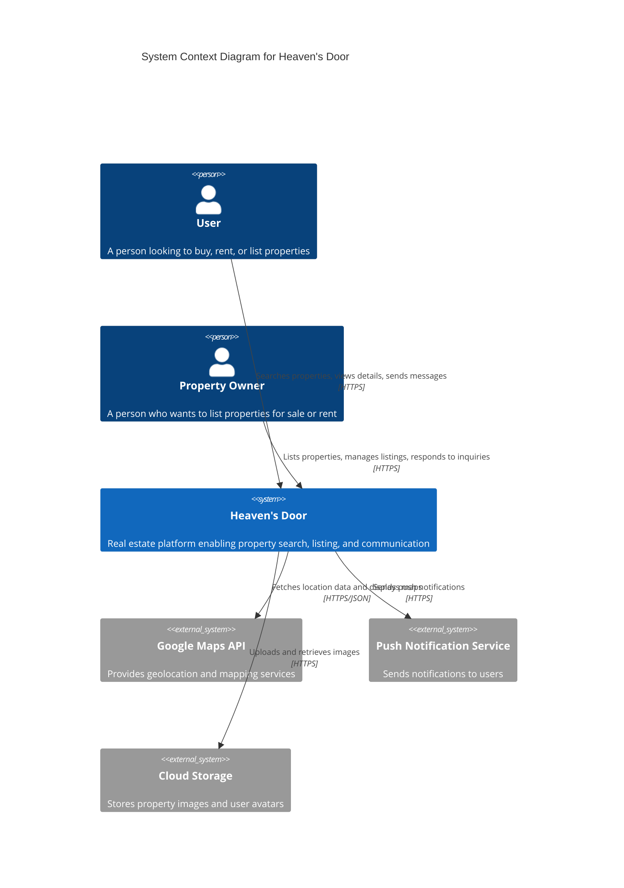
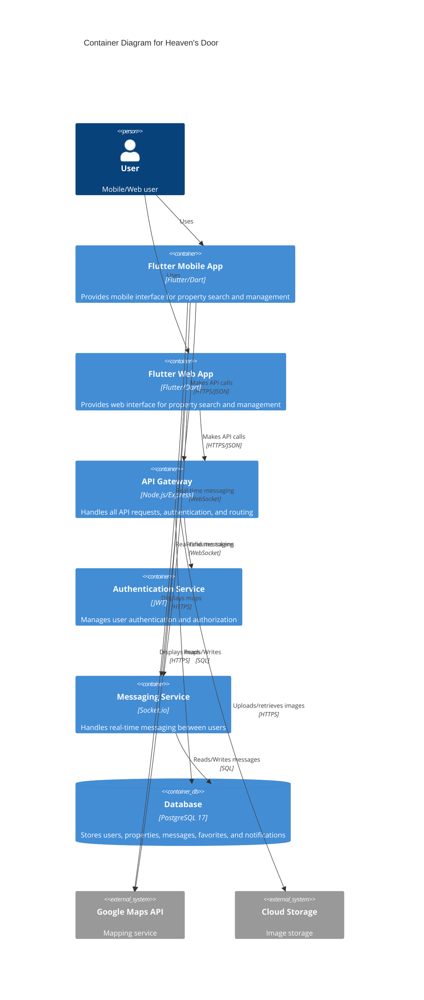
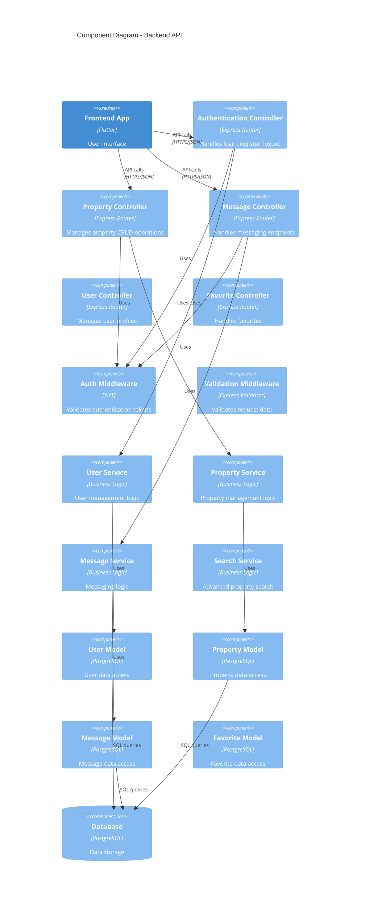
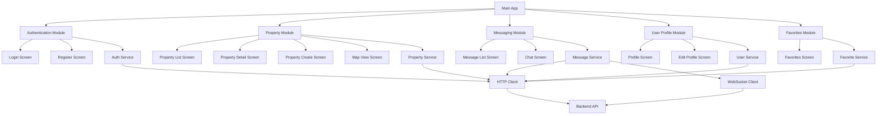

# Heaven's Door - Architecture Documentation

## C4 Model Overview

This document follows the C4 model for visualizing software architecture at different levels of abstraction.

## Level 1: System Context Diagram

Shows how Heaven's Door fits into the world around it.



**Key Users:**
- **End Users**: Search and view properties, save favorites, contact property owners
- **Property Owners**: Create and manage property listings, respond to inquiries

**External Systems:**
- **Google Maps API**: Geolocation and interactive maps
- **Push Notification Service**: Real-time notifications
- **Cloud Storage**: Image and media storage

## Level 2: Container Diagram

Shows the high-level technology choices and how containers communicate.



**Containers:**

1. **Flutter Mobile/Web App** (Frontend)
   - Technology: Flutter, Dart
   - Responsibilities: UI/UX, user interactions, state management
   - Communication: REST API (HTTPS/JSON), WebSocket for messaging

2. **API Gateway** (Backend)
   - Technology: Node.js, Express.js
   - Responsibilities: Request routing, business logic, data validation
   - Port: 3000

3. **Authentication Service**
   - Technology: JWT, bcrypt
   - Responsibilities: User authentication, token management, password security

4. **Messaging Service**
   - Technology: Socket.io
   - Responsibilities: Real-time bidirectional communication

5. **PostgreSQL Database**
   - Technology: PostgreSQL 17
   - Responsibilities: Persistent data storage
   - Port: 5432

## Level 3: Component Diagram

### Backend API Components



### Frontend Components



## Data Flow

### Property Search Flow
1. User enters search criteria in Flutter app
2. App sends GET request to `/api/properties?filters=...`
3. API Gateway validates request
4. Property Service queries database with filters
5. Results returned to app with pagination
6. App displays properties in list/grid view
7. User can view location on map via Google Maps integration

### Messaging Flow
1. User sends message from chat screen
2. Message sent via WebSocket to Messaging Service
3. Service stores message in database
4. Service broadcasts message to recipient in real-time
5. Recipient receives notification
6. Message appears in recipient's chat screen

### Property Listing Flow
1. Property owner creates listing with photos
2. Images uploaded to Cloud Storage
3. API creates property record with image URLs
4. Database stores property data
5. Property appears in search results for other users

## Security Architecture

- **Authentication**: JWT tokens with 7-day expiration
- **Authorization**: Role-based access control (User, Property Owner, Admin)
- **Password Storage**: bcrypt hashing with salt rounds
- **API Security**: CORS, Rate limiting, Input validation
- **Database**: Parameterized queries to prevent SQL injection
- **HTTPS**: All API communication encrypted

## Deployment Architecture

```
┌─────────────────────────────────────────────┐
│           Docker Compose Stack              │
│                                             │
│  ┌──────────────┐      ┌─────────────────┐ │
│  │   Backend    │      │   PostgreSQL    │ │
│  │  (Node.js)   │◄────►│   Database      │ │
│  │   Port 3000  │      │   Port 5432     │ │
│  └──────────────┘      └─────────────────┘ │
│         ▲                                   │
│         │                                   │
└─────────┼───────────────────────────────────┘
          │
          │ HTTPS/JSON
          │
    ┌─────▼──────┐
    │  Flutter   │
    │    App     │
    │ (Mobile/Web)│
    └────────────┘
```

## Technology Decisions

### Why Flutter?
- Single codebase for mobile and web
- High performance with native compilation
- Rich UI widgets and animations (perfect for JoJo theme!)
- Strong community and package ecosystem

### Why Node.js/Express?
- JavaScript ecosystem familiarity
- Fast development with middleware pattern
- Excellent async I/O performance
- Large package ecosystem (npm)

### Why PostgreSQL?
- ACID compliance for data integrity
- Advanced querying capabilities for property search
- JSON support for flexible data
- Robust and reliable

### Why Docker?
- Consistent development environment
- Easy deployment and scaling
- Isolated services
- Simple multi-container orchestration

## Performance Considerations

- **Database Indexing**: Indexes on search fields (location, price, type)
- **Caching**: Redis for frequently accessed data (future enhancement)
- **Image Optimization**: CDN for image delivery
- **Pagination**: Limit query results to improve response time
- **Lazy Loading**: Load images on demand in Flutter
- **Connection Pooling**: Database connection pooling for efficiency

## Scalability Strategy

- **Horizontal Scaling**: Multiple backend instances behind load balancer
- **Database Replication**: Read replicas for search queries
- **Microservices**: Split services as needed (messaging, search)
- **CDN**: Distribute static assets globally
- **Caching Layer**: Redis for session management and frequent queries

---

*"With Heaven's Door, the architecture is as precisely crafted as Rohan's manga panels!"*
